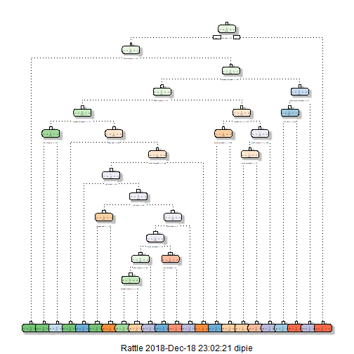
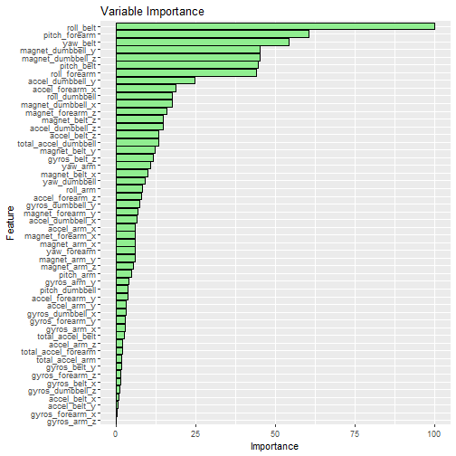

# PRACTICAL MACHINE LEARNING COURSE PROJECT:  PREDICTING AND CLASSIFYING USING THE WEIGHT LIFTING EXERCISE DATASET

## EXECUTIVE SUMMARY
This report summarizes the prediction of exercise type using the Weight Lifting Exercise Dataset.  This dataset contains accelerometer data from the belt, forearm, arm, and dumbell of 6 participants.  The data quantifies the motion profile for each user as they conducted barbell lifts with different variations, designated as classes "A"-"E".  

For this project, the dataset was first cleansed, then trained and modeled using the Classification Tree, Random Forest, and Generalized Boost Model techniques presented in the Practical Machine Learning course.   Of these techniques, the Random Forest model produced the highest quality predictions when applied to the test dataset, and was able to correctly identify all twenty exercise cases in the course final quiz.

## Project Description
Using devices such as Jawbone Up, Nike FuelBand, and Fitbit it is now possible to collect a large amount of data about personal activity relatively inexpensively. These type of devices are part of the quantified self movement - a group of enthusiasts who take measurements about themselves regularly to improve their health, to find patterns in their behavior, or because they are tech geeks. One thing that people regularly do is quantify how much of a particular activity they do, but they rarely quantify how well they do it. In this project, your goal will be to use data from accelerometers on the belt, forearm, arm, and dumbell of 6 participants. They were asked to perform barbell lifts correctly and incorrectly in 5 different ways. More information is available from the website here: http://web.archive.org/web/20161224072740/http:/groupware.les.inf.puc-rio.br/har (see the section on the Weight Lifting Exercise Dataset).

## Setup
First load required libraries.


```r
library(caret)
library(dplyr)
library(rattle)
library(parallel)
library(doParallel)
library(rpart)
library(rpart.plot)
library(ggplot2)
```

Before proceeding, set a seed to ensure consistent and reproducible results when running the analysis multiple times.

```r
set.seed(1357)
```

## Data Preparation
The first step is to import the Weight Lifing Exercise dataset.  The data is organized in a training set, and a test set.  The training file is a large set of data consisting of identifier information, time stamps, and movement measurements organized across 160 fields  The test file consists of twenty exercise cases which will be identified using the modeling results.

First, load the data into training and test tables:

```r
#Load in training and test data sets
train <- read.csv("pml-training.csv")
test <- read.csv("pml-testing.csv")

# Training data has many columns with mostly NAs.  Check for columns that are over half populated with "NAs" and reemove columns
RemNA <- sapply(train, function(x) mean(is.na(x))) > 0.50
train1 <- train[, RemNA==F]

# Remove fields that are not useful as predictors (1:8) 
train1 <- train1[,8:length(train1)]

#remove columns with variables that do not change (near zero variance)
NZV <- nearZeroVar(train1)
train1 <- train1[, -NZV]
dim(train1)
```

```
## [1] 19622    53
```
The result of this cleansing is a Test Dataset that consists of 53 fields.  The remainder of the 160 original fields are discarded because they do not have any value for prediction model development. 

Next, create a partition in the training data set.  70% of the training set will be for training, and the remaining 30% for testing the model.  The FINAL test set is not used for predicting the exercises until the end, after the model is validated.

```r
#create partitions in the training set to fit the model (70/30)
inTrain <- createDataPartition(y=train1$classe, p=0.7, list=FALSE)
pTrain <- train1[inTrain, ]
pTest <- train1[-inTrain, ]
dim(pTrain)
```

```
## [1] 13737    53
```

During model development, the random forest and GBM operations were found to take a very long time to execute on the i5 processor. To speed things up I configured the script to use a multi-core cluster and perform parallel processing.  

```r
# Setup mulicore cluster - Random Forest was taking very long with single core
cluster <- makeCluster(detectCores() - 1) # convention to leave 1 core for OS
registerDoParallel(cluster)
```

## Developing the Model
Three approaches were used:  Classification Tree, Random Forest, and Generalized Boost Model.  The GBM was used to evaluate whether additional accuracy could be achieved beyond what the first two models produced.

### Classification Tree  


```r
fitControl <- trainControl(method = "cv", number = 5, allowParallel = TRUE)

model_CT <- train(classe~., data=pTrain, method="rpart", trControl=fitControl)
ClassTreeMod1 <- rpart(classe ~ ., pTrain,method ="class")
fancyRpartPlot(ClassTreeMod1)
```

```
## Warning: labs do not fit even at cex 0.15, there may be some overplotting
```



```r
predictCT <- predict(ClassTreeMod1, pTest,type="class")

cmdt <- confusionMatrix(predictCT, pTest$classe)
cmdt  # Confusion Matrix for Decision Tree
```

```
## Confusion Matrix and Statistics
## 
##           Reference
## Prediction    A    B    C    D    E
##          A 1416  150   12   31   15
##          B   46  653   59   71   80
##          C  137  224  830  141  105
##          D   61   71   61  653   71
##          E   14   41   64   68  811
## 
## Overall Statistics
##                                         
##                Accuracy : 0.7414        
##                  95% CI : (0.73, 0.7525)
##     No Information Rate : 0.2845        
##     P-Value [Acc > NIR] : < 2.2e-16     
##                                         
##                   Kappa : 0.6736        
##  Mcnemar's Test P-Value : < 2.2e-16     
## 
## Statistics by Class:
## 
##                      Class: A Class: B Class: C Class: D Class: E
## Sensitivity            0.8459   0.5733   0.8090   0.6774   0.7495
## Specificity            0.9506   0.9461   0.8751   0.9464   0.9611
## Pos Pred Value         0.8719   0.7184   0.5776   0.7121   0.8126
## Neg Pred Value         0.9395   0.9023   0.9559   0.9374   0.9445
## Prevalence             0.2845   0.1935   0.1743   0.1638   0.1839
## Detection Rate         0.2406   0.1110   0.1410   0.1110   0.1378
## Detection Prevalence   0.2760   0.1545   0.2442   0.1558   0.1696
## Balanced Accuracy      0.8982   0.7597   0.8420   0.8119   0.8553
```
As seen in the confusion matrix, the accuracy of the classification tree approach was 0.7414 and the out of sample error was 0.2586.  

### Random Forest with parallel cores

```r
# Use parallel process to execute random forest training
system.time(modRF <- train(classe ~., method="rf",data=pTrain,trControl = fitControl))
```

```
##    user  system elapsed 
##   54.29    4.44  304.01
```

```r
modRF
```

```
## Random Forest 
## 
## 13737 samples
##    52 predictor
##     5 classes: 'A', 'B', 'C', 'D', 'E' 
## 
## No pre-processing
## Resampling: Cross-Validated (5 fold) 
## Summary of sample sizes: 10989, 10989, 10990, 10991, 10989 
## Resampling results across tuning parameters:
## 
##   mtry  Accuracy   Kappa    
##    2    0.9913370  0.9890395
##   27    0.9919193  0.9897773
##   52    0.9851491  0.9812115
## 
## Accuracy was used to select the optimal model using the largest value.
## The final value used for the model was mtry = 27.
```

```r
# find and plot the most important variables in the data
MostImpVars <- varImp(modRF)
MostImpVars
```

```
## rf variable importance
## 
##   only 20 most important variables shown (out of 52)
## 
##                      Overall
## roll_belt            100.000
## pitch_forearm         60.546
## yaw_belt              54.116
## magnet_dumbbell_y     45.165
## magnet_dumbbell_z     45.028
## pitch_belt            44.374
## roll_forearm          43.867
## accel_dumbbell_y      24.541
## accel_forearm_x       18.732
## roll_dumbbell         17.463
## magnet_dumbbell_x     17.436
## magnet_forearm_z      15.768
## magnet_belt_z         14.776
## accel_dumbbell_z      14.763
## accel_belt_z          13.267
## total_accel_dumbbell  13.251
## magnet_belt_y         12.248
## gyros_belt_z          11.549
## yaw_arm               10.829
## magnet_belt_x          9.985
```

```r
#varImpPlot(modRF)

# Use the fitted RF model to predict with the test data 
predictRF <- predict(modRF, newdata=pTest)
cmrf <- confusionMatrix(predictRF, pTest$classe)

# MostImpVars <- varImp(modRF)
# MostImpVars
```
The maximum accuracy for this model was 0.9919193 and occured with a variable quantity of 27 (mtry). The out of sample error was 0.0080807.  

###Inspect Importance of Variables
The figure below shows the relative importance of the predictors.  The weighting is dominated by "roll_belt", followed by "pitch_forearm" and "yaw_belt".   

```r
ggplot(data=MostImpVars) + 
  geom_bar(position="dodge",stat="identity",colour="black",fill="lightgreen") + 
  ggtitle("Variable Importance")  
```



###  Boost Model.  See if additional variables help the model  

Now see if the Generalized Boost Model will add additional accuracy by boosting using all variables.  


```r
controlGBM <- trainControl(method = "repeatedcv", number = 5, repeats = 1)
system.time(modFitGBM  <- train(classe ~ ., data=pTrain, method = "gbm",trControl = controlGBM, verbose = FALSE))
```

```
##    user  system elapsed 
##   30.27    1.67  127.04
```

```r
modFitGBM$finalModel
```

```
## A gradient boosted model with multinomial loss function.
## 150 iterations were performed.
## There were 52 predictors of which 41 had non-zero influence.
```

```r
stopCluster(cluster)
predictGBM <- predict(modFitGBM, newdata=pTest)
confMatGBM <- confusionMatrix(predictGBM, pTest$classe)
confMatGBM
```

```
## Confusion Matrix and Statistics
## 
##           Reference
## Prediction    A    B    C    D    E
##          A 1636   48    0    0    0
##          B   28 1056   25    7   14
##          C    9   29  984   36    5
##          D    1    5   15  913   10
##          E    0    1    2    8 1053
## 
## Overall Statistics
##                                           
##                Accuracy : 0.9587          
##                  95% CI : (0.9533, 0.9636)
##     No Information Rate : 0.2845          
##     P-Value [Acc > NIR] : < 2.2e-16       
##                                           
##                   Kappa : 0.9478          
##  Mcnemar's Test P-Value : NA              
## 
## Statistics by Class:
## 
##                      Class: A Class: B Class: C Class: D Class: E
## Sensitivity            0.9773   0.9271   0.9591   0.9471   0.9732
## Specificity            0.9886   0.9844   0.9837   0.9937   0.9977
## Pos Pred Value         0.9715   0.9345   0.9257   0.9672   0.9897
## Neg Pred Value         0.9910   0.9825   0.9913   0.9897   0.9940
## Prevalence             0.2845   0.1935   0.1743   0.1638   0.1839
## Detection Rate         0.2780   0.1794   0.1672   0.1551   0.1789
## Detection Prevalence   0.2862   0.1920   0.1806   0.1604   0.1808
## Balanced Accuracy      0.9830   0.9558   0.9714   0.9704   0.9855
```
The maximum accuracy for this model was 0.9587, which is slightly lower than with the Random Forest Model.  The out of sample error was 0.0413.  


### Predict exercise classification using the Final Test set   
The resulting accuracy of the three models tested is shown in the table below.  From these results, Random Forest modeling produced the highest accuracy result. I use this model to classify the exercise classes in the final test set.  


```r
acc_sum <- matrix(c(round(cmdt$overall[[1]],4),round(max( modRF$results[1:3,2]),4), round(confMatGBM$overall[[1]],4)),ncol=1)
colnames(acc_sum)<- c('Accuracy')
rownames(acc_sum)<- c('Classification Tree','Random Forest','GBM')
acc_sum
```

```
##                     Accuracy
## Classification Tree   0.7414
## Random Forest         0.9919
## GBM                   0.9587
```

##Final Prediction using Random Forest and the Final Test Data
Applying the Random Forest model to the final test data produces the following Class predictions.  These were all correctly identified based on the final course quiz.


```r
predFINAL <-  predict(modRF, newdata=test)
predFINAL
```

```
##  [1] B A B A A E D B A A B C B A E E A B B B
## Levels: A B C D E
```
